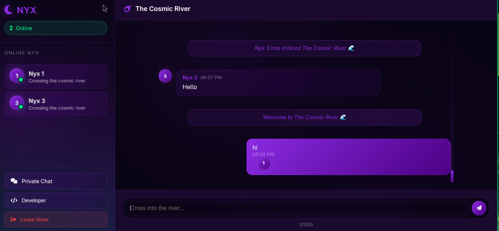

# NYX - The Cosmic River Chat



A real-time chat application inspired by the cosmic river from *Unfriended 2*, where users communicate through the eternal darkness guided by Nyx, the Greek goddess of the night.

## 🌐 Go to Website
Visit the live application: [veillemm.netlify.app](https://veillemm.netlify.app)

## 🌙 About NYX

In Greek mythology, **Nyx** is the primordial goddess of the night, one of the first elements of creation. In this chat application, Nyx serves as the mystical entity that guides souls through the cosmic river - a digital realm where users can communicate in real-time.

Each user becomes a "Nyx" with a unique number, traversing the eternal darkness of the digital cosmos, sending messages across the cosmic river to other wandering souls.

## ✨ Features

### 🌊 Public Chat - The Cosmic River
- **Real-time messaging** in the main cosmic river
- **User presence tracking** with online/offline status
- **Automatic join/leave notifications** when users enter or exit the river
- **Mobile responsive** design with drawer navigation
- **Sound notifications** for new messages
- **Typing indicators** showing when someone is composing a message

### 🔒 Private Chat - One-on-One Conversations
- **Direct messaging** with any user (online or offline)
- **Message history** loading for each conversation
- **Read/unread status** tracking
- **Real-time delivery** when both users are online
- **Offline messaging** - messages delivered when user comes online
- **User selection** from comprehensive user list

### 👤 User Management
- **Automatic Nyx numbering** (Nyx #1, Nyx #2, etc.)
- **Profile creation** with full name and email
- **Online status tracking** with last seen timestamps
- **Status messages** for user expression

## 🏗️ Architecture

### Frontend Technologies
- **HTML5** - Semantic structure
- **CSS3** - Cosmic dark theme with animations
- **Vanilla JavaScript** - No frameworks, pure performance
- **Font Awesome** - Icon library
- **Responsive Design** - Mobile-first approach

### Backend Services
- **Supabase** - Authentication, database, and real-time subscriptions
- **PostgreSQL** - Database with Row Level Security (RLS)
- **Real-time subscriptions** - Live updates without polling

### Database Schema

#### Profiles Table
```sql
- id (UUID) - User authentication reference
- full_name (TEXT) - User's real name
- email (TEXT) - User's email address
- nyx_name (TEXT) - Generated "Nyx #X" identifier
- nyx_number (INTEGER) - Unique sequential number
- is_online (BOOLEAN) - Current online status
- last_seen (TIMESTAMP) - Last activity timestamp
- status_message (TEXT) - User's custom status
```

#### Messages Table (Public Chat)
```sql
- id (UUID) - Message identifier
- sender_id (UUID) - Message sender reference
- sender_nyx_name (TEXT) - Sender's Nyx identifier
- sender_nyx_number (INTEGER) - Sender's Nyx number
- message (TEXT) - Message content
- message_type (TEXT) - Type: text, system, join, leave
- created_at (TIMESTAMP) - Message timestamp
```

#### Private Messages Table
```sql
- id (UUID) - Private message identifier
- sender_id (UUID) - Message sender
- receiver_id (UUID) - Message recipient
- sender_nyx_name (TEXT) - Sender's Nyx name
- receiver_nyx_name (TEXT) - Receiver's Nyx name
- sender_nyx_number (INTEGER) - Sender's number
- receiver_nyx_number (INTEGER) - Receiver's number
- message (TEXT) - Message content
- message_type (TEXT) - Type: text, system
- is_read (BOOLEAN) - Read status tracking
- created_at (TIMESTAMP) - Message timestamp
```

## 🚀 Getting Started

### Prerequisites
- Node.js (for local development)
- Supabase account and project
- Modern web browser with JavaScript enabled

### Installation

1. **Clone the repository**
   ```bash
   git clone https://github.com/yourusername/nyx-chat.git
   cd nyx-chat
   ```

2. **Set up Supabase**
   - Create a new Supabase project
   - Run the provided SQL schema in the Supabase SQL editor
   - Configure authentication settings
   - Enable real-time for all tables

3. **Configure Supabase Connection**
   - Open `supabase-config.js`
   - Replace with your Supabase URL and anon key:
   ```javascript
   window.supabaseConfig = {
       supabaseUrl: 'YOUR_SUPABASE_URL',
       supabaseAnonKey: 'YOUR_SUPABASE_ANON_KEY'
   };
   ```

4. **Deploy or Run Locally**
   - For local development, use a simple HTTP server:
   ```bash
   npx serve .
   ```
   - Or deploy to any static hosting service (Netlify, Vercel, etc.)

### Database Setup

Run the complete SQL schema in your Supabase SQL editor:

```sql
-- Complete schema provided in database-setup.sql
-- Includes tables, functions, indexes, RLS policies, and real-time setup
```

## 📁 Project Structure

```
nyx/
├── index.html              # Landing page with cosmic journey
├── login.html              # User authentication
├── register.html           # User registration
├── chat.html              # Public cosmic river chat
├── private_chat.html       # Private messaging interface
├── users.html             # User selection for private chat
├── css/
│   ├── styles.css         # Main landing page styles
│   ├── login.css          # Authentication styles
│   ├── chat.css           # Chat interface styles
│   └── cosmic_river_css.css # Cosmic theme styles
├── js/
│   ├── script.js          # Landing page interactions
│   ├── login.js           # Authentication logic
│   ├── register.js        # Registration logic
│   ├── supabase-config.js # Database configuration
│   ├── simple_online_status.js # Online status management
│   ├── original_working_chat.js # Public chat functionality
│   ├── private_chat.js    # Private messaging logic
│   └── users_page.js     # User selection logic
├── screenshots/           # Application screenshots
└── README.md             # This file
```

## 🎨 Design Philosophy

### The Cosmic Theme
The application embraces the darkness and mystery of Nyx's domain:

- **Dark color palette** - Deep blacks, purples, and cosmic blues
- **Animated backgrounds** - Flowing cosmic rivers and star fields
- **Glowing elements** - Ethereal light effects for interactions
- **Smooth transitions** - Fluid movements between states

### User Experience
- **Immersive onboarding** - Users "cross the threshold" into Nyx's realm
- **Intuitive navigation** - Clear paths between public and private spaces
- **Real-time feedback** - Immediate responses to all actions
- **Mobile optimization** - Full functionality on all devices

## 🔧 Technical Implementation

### Real-time Subscriptions
The application uses Supabase's real-time capabilities for:

- **Public messages** - Live updates in the cosmic river
- **Private messages** - Direct message delivery
- **Online status** - User presence tracking
- **Profile updates** - Status and information changes

### Security Features
- **Row Level Security (RLS)** - Database access control
- **Authentication** - Secure user login/registration
- **Input sanitization** - XSS prevention
- **Message validation** - Content filtering and limits

### Performance Optimizations
- **Efficient queries** - Optimized database calls
- **Lazy loading** - Load data as needed
- **Minimal dependencies** - Fast loading times
- **Caching strategies** - Reduce redundant requests

## 🎮 User Journey

1. **Arrival** - Users land on the cosmic threshold (`index.html`)
2. **Authentication** - Login or register to enter Nyx's realm
3. **Public River** - Join the main cosmic river chat
4. **Private Conversations** - Select users for one-on-one messaging
5. **Presence** - See who's currently traversing the river
6. **Departure** - Leave the cosmic realm when done

## 🔮 Future Enhancements

- **Voice messages** - Audio communication in the darkness
- **File sharing** - Exchange cosmic artifacts
- **Message reactions** - Emotional responses to messages
- **User themes** - Customize cosmic appearance
- **Message encryption** - End-to-end encryption for privacy
- **Push notifications** - Mobile notifications for new messages
- **Message search** - Find past conversations
- **User blocking** - Control who can contact you

## 🐛 Troubleshooting

### Common Issues

**Messages not appearing in real-time:**
- Check Supabase real-time is enabled
- Verify RLS policies allow access
- Check browser console for subscription errors

**Online status not updating:**
- Ensure `cleanup_offline_users` function exists
- Check heartbeat intervals are running
- Verify timestamp comparisons

**Private messages not delivering:**
- Confirm both users have valid profiles
- Check `private_messages` table permissions
- Verify message recipient exists

### Debug Mode
Enable console logging by checking browser developer tools for detailed application state and error messages.

## 📄 License

This project is open source and available under the [MIT License](LICENSE).

## 🙏 Acknowledgments

- **Supabase** - Backend as a Service platform
- **Font Awesome** - Icon library
- **Greek Mythology** - Inspiration from Nyx, goddess of night
- **Unfriended 2** - Cosmic river concept inspiration

---

*Enter the eternal night. Cross the cosmic river. Communicate through the darkness.* 🌙✨